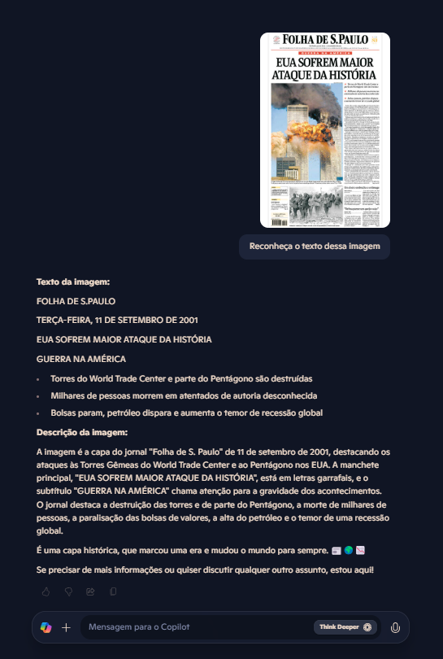
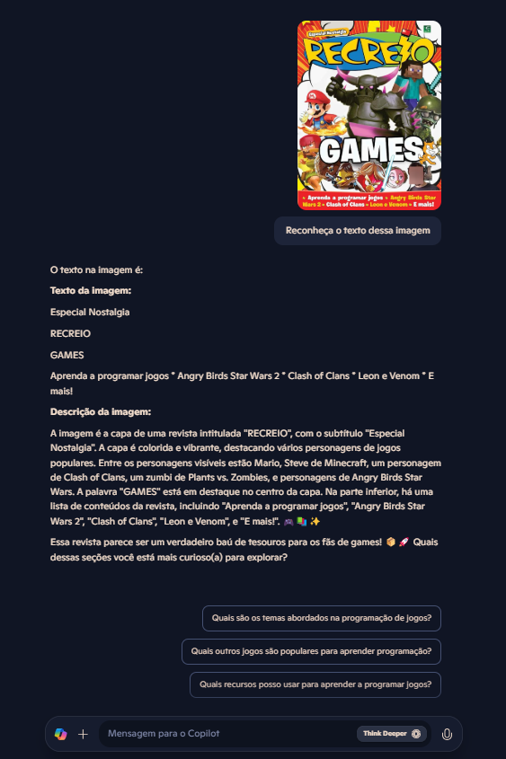
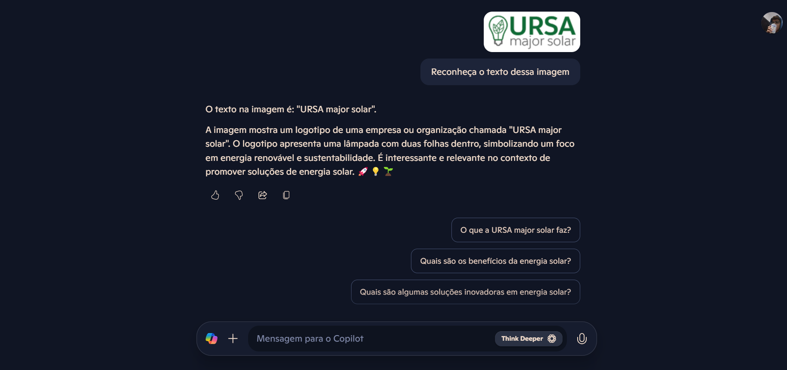

# Aprendizagem-Copilot

O Copilot da Microsoft pode reconhecer texto em imagens utilizando tecnologias como OCR (Optical Character Recognition).

Ao inserir as imagens e pedir para que a IA reconheça os textos presentes nas mesmas, obtive uma descrição clara e detalhada de todo texto presente nas imagens. Uma forma simplificada e eficiente de detecção de textos presentes em imagens, tornando processos como digitalização, tradução e automação mais acessíveis e práticos.

# Insights e Possibilidades Adquiridos durante o conteúdo: 

- Precisão: Funciona melhor com imagens de alta qualidade e textos bem definidos.

- Idiomas e Tradução: O Copilot pode identificar múltiplos idiomas e traduzi-los automaticamente.

- Documentos Digitalizados: Excelente para digitalizar documentos físicos sem precisar reescrevê-los.

- Acessibilidade: Pode ajudar na leitura de textos para pessoas com deficiência visual.

- Automação: Pode ser integrado a fluxos de trabalho para processar documentos automaticamente.

